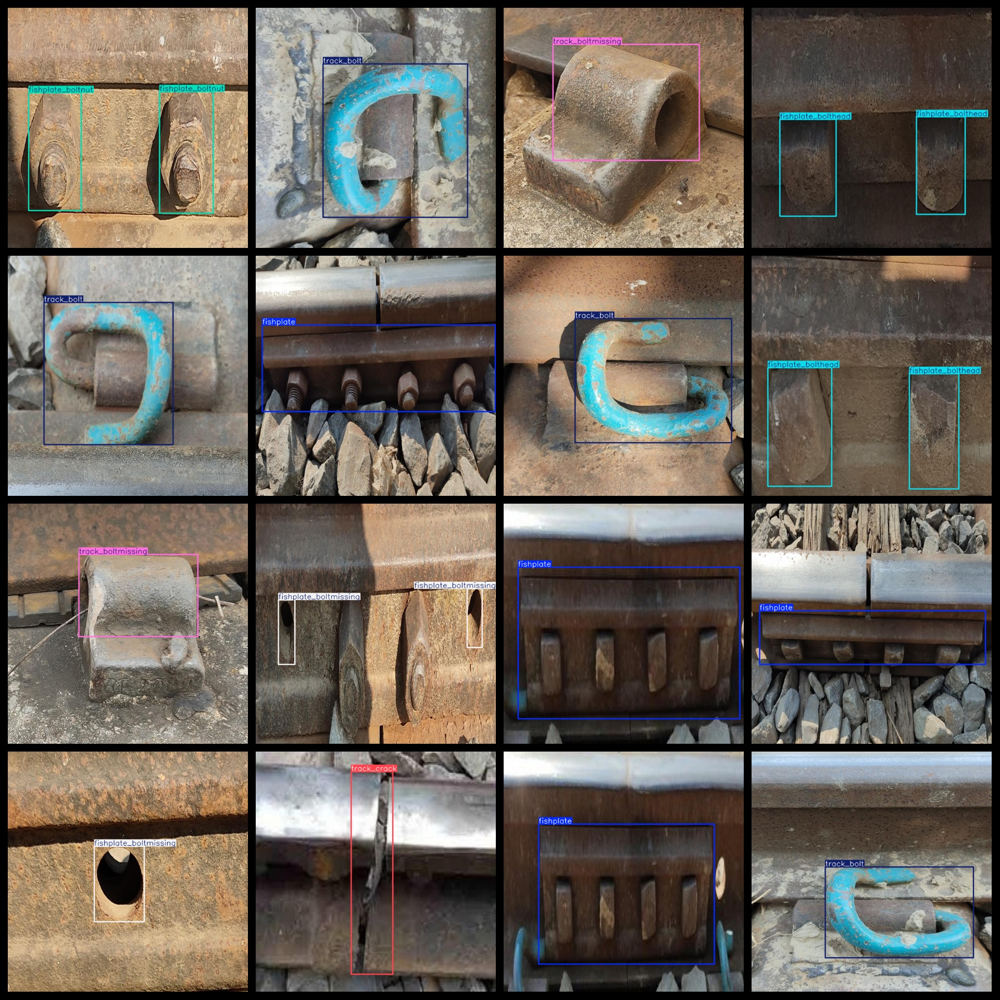

# Railway Track Fishplate Defect Dataset 1069 imagesVOC+YOLO format

The railway track fishplate defect dataset consists of 1069 images in the VOC+YOLO format.

The dataset is organized as follows: it contains Pascal VOC format images along with YOLO format text files (excluding the split path txt file, but only including JPG images and their corresponding VOC format xml files and YOLO format text files).

Number of images (in JPG files): 1069

Number of annotations (in xml files): 1069

Number of annotations (in text files): 1069

Number of annotation categories: 7

Repository where the dataset is stored: datasets_sl

Annotation category names (noting that the order of categories in the YOLO format does not correspond to this, but rather, refer to the "labels" folder's "classes.txt" file): ["fishplate", "fishplate_bolthead", "fishplate_boltmissing", "fishplate_boltnut", "track_bolt", "track_boltmissing", "track_crack"]

The number of bounding boxes for each category:

- fishplate: 148 (fishplate)
- fishplate_bolthead: 291 (fishplate bolthead)
- fishplate_boltmissing: 179 (fishplate bolt missing)
- fishplate_boltnut: 284 (fishplate boltnut)
- track_bolt: 152 (track bolt)
- track_boltmissing: 155 (track bolt missing)
- track_crack: 166 (track crack)

Total number of bounding boxes: 1375

Each category occupies a number of images:

- fishplate: 148 images
- fishplate_bolthead: 149 images
- fishplate_boltmissing: 149 images
- fishplate_boltnut: 150 images
- track_bolt: 152 images
- track_boltmissing: 155 images
- track_crack: 166 images

Image resolution: 640x640

Annotation tool used: labelImg

Dataset enhancement status: No

Annotation rules: draw a rectangle around the category -15

Important notice: The dataset does not have been divided into training, validation, or test sets; users are required to divide it on their own.

Special declaration: This dataset does not guarantee any accuracy in the trained models or weight files.

Annotation and image situation is as follows:

## Images

---

Here is a pay link on Stripe (https://buy.stripe.com/3cs8yP7sY87d0vu9AB). Please contact me lonlonago@foxmail.com after funding $89, and I will send you a complete data files, thank you!

